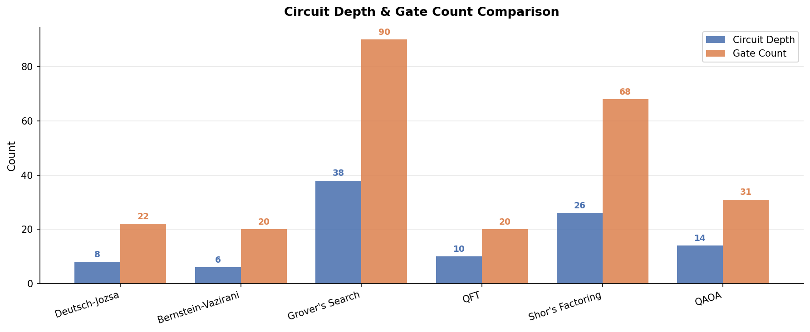
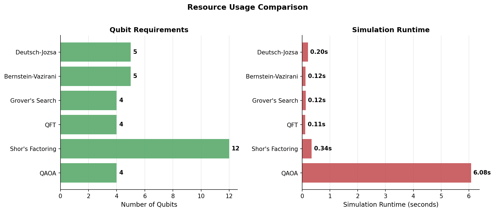
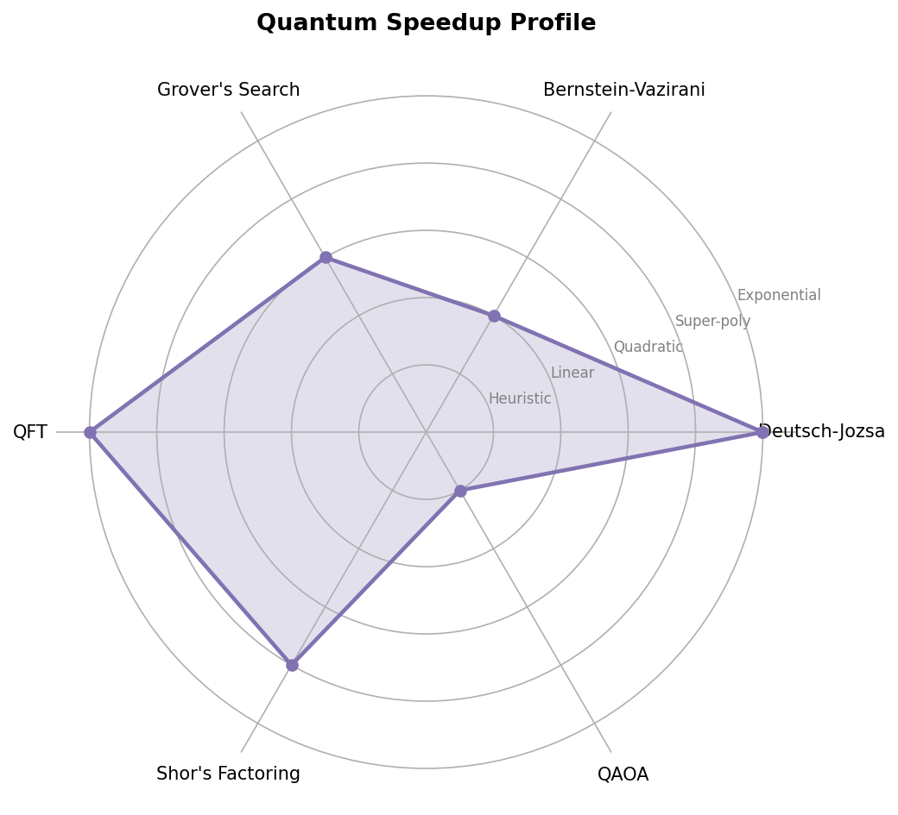
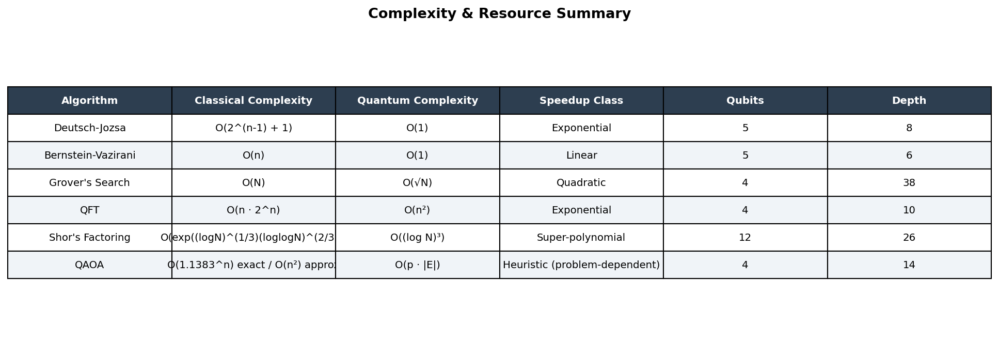
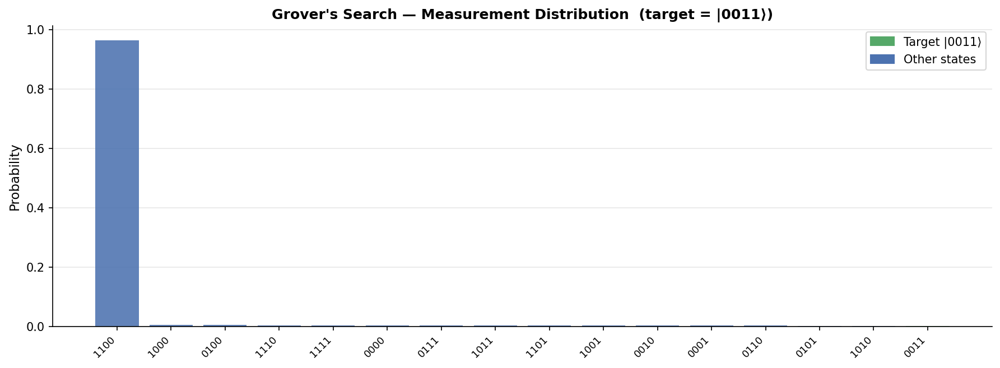

# ⚛️ Quantum Algorithms Comparative Study

A comprehensive implementation and benchmarking suite for **six foundational quantum algorithms**, comparing circuit complexity, gate requirements, qubit usage, and classical vs quantum speedup — all built with **Qiskit** and fully reproducible.

> **Built as part of a portfolio project demonstrating quantum computing fundamentals.**

---

## 📌 Algorithms Covered

| Algorithm | Problem | Classical | Quantum | Speedup |
|-----------|---------|-----------|---------|---------|
| **Deutsch-Jozsa** | Constant vs balanced function | O(2^(n−1) + 1) | **O(1)** | Exponential |
| **Bernstein-Vazirani** | Find hidden bit-string | O(n) | **O(1)** | Linear |
| **Grover's Search** | Search unsorted database | O(N) | **O(√N)** | Quadratic |
| **QFT** | Discrete Fourier Transform | O(n·2^n) | **O(n²)** | Exponential |
| **Shor's Factoring** | Integer factorization | O(exp((log N)^⅓)) | **O((log N)³)** | Super-polynomial |
| **QAOA** | Combinatorial optimization (Max-Cut) | O(1.1383^n) | **O(p·\|E\|)** | Heuristic |

---

## 📊 Results

### Circuit Metrics


### Resource Usage


### Quantum Speedup Profile


### Complexity Summary


### Grover's Search Distribution


---

## 🗂️ Project Structure

```
quantum-algorithms-comparison/
├── algorithms/
│   ├── deutsch_jozsa.py      # Deutsch-Jozsa: O(1) oracle classification
│   ├── bernstein_vazirani.py # BV: recover n-bit secret in 1 query
│   ├── grover.py             # Grover: O(√N) amplitude amplification
│   ├── qft.py                # QFT: n² gate Fourier transform
│   ├── shor.py               # Shor: QPE-based period finding for N=15
│   └── qaoa.py               # QAOA p=2: variational Max-Cut solver
├── benchmarks/
│   └── benchmark.py          # Timing, gate count, depth harness
├── plots/                    # Generated comparison charts
├── results/
│   └── comparison_results.json
├── main.py                   # Entry point — runs everything
└── requirements.txt
```

---

## 🚀 Getting Started

### Prerequisites
```bash
python >= 3.10
```

### Installation
```bash
git clone https://github.com/YOUR_USERNAME/quantum-algorithms-comparison.git
cd quantum-algorithms-comparison
pip install -r requirements.txt
```

### Run Everything
```bash
python main.py
```

This will:
1. Run all 6 algorithms with Qiskit's statevector simulator
2. Print a full benchmark table to stdout
3. Save 5 comparison plots to `./plots/`
4. Save JSON results to `./results/comparison_results.json`

### Use Individual Algorithms
```python
from algorithms import Grover, QFT, QAOA

# Grover's search on 4-qubit space
g = Grover(n=4, target="1011")
result = g.run(shots=1024)
print(result["found"], result["prob_target"])

# QFT on a specific input state
q = QFT(n=5, input_state="10110")
result = q.run()

# QAOA for Max-Cut (p=3 layers)
qaoa = QAOA(edges=[(0,1,1),(1,2,1),(2,3,1),(3,0,1)], p=3)
result = qaoa.run()
print(result["best_cut"], result["approx_ratio"])
```

---

## 🔬 Algorithm Deep-Dives

### Deutsch-Jozsa
The algorithm places all input qubits in superposition via Hadamard gates, applies a single oracle query that encodes phase information via kickback, then applies another Hadamard layer. Constructive interference produces |0…0⟩ for constant functions and destructive interference for balanced ones — giving a **deterministic answer in one shot** vs exponentially many classical queries.

### Bernstein-Vazirani
Structurally identical to Deutsch-Jozsa but the oracle computes `f(x) = s·x mod 2`. The Hadamard sandwich + phase kickback reveals **all n bits of secret s simultaneously** in a single measurement, compared to n separate classical queries.

### Grover's Search
The oracle phase-flips the target state. The diffusion operator (inversion about the mean) then **amplifies the target amplitude** by a small amount each iteration. After ⌊π/4·√N⌋ iterations the target dominates with probability > 0.5, giving a provably optimal **quadratic speedup**.

### Quantum Fourier Transform (QFT)
Decomposes into n Hadamard gates + O(n²) controlled-phase (CPhase) rotations, achieving the DFT in **O(n²) gates vs O(n·2^n)** for the classical FFT. It is the core subroutine in Shor's algorithm and quantum phase estimation.

### Shor's Factoring
Reduces factoring to period-finding of `f(x) = aˣ mod N`. **Quantum Phase Estimation** (built on QFT) finds the period r exponentially faster than any known classical method. Given r, classical GCD arithmetic yields the factors. The implementation here demonstrates the full QPE circuit for N=15, a=7 (period r=4 → factors 3, 5).

### QAOA
A **variational quantum-classical hybrid**. A parameterized circuit alternates between a phase separator (encodes the cost Hamiltonian via ZZ interactions) and a mixer (Rx rotations). A classical optimizer (COBYLA) tunes the angles γ, β to maximize ⟨H_C⟩. As the layer count p → ∞, QAOA converges to the optimal solution.

---

## ⚙️ Implementation Notes

- **Framework**: [Qiskit 2.x](https://www.ibm.com/quantum/qiskit) with Aer statevector simulator
- **Shor's**: Uses hand-coded controlled-U gates for N=15 (pedagogical approach; generalizing requires O((logN)³) qubit arithmetic circuits)
- **QAOA**: Classical optimizer is `scipy.optimize.COBYLA` with 150 iterations
- **Grover's**: Uses optimal iteration count ⌊π/4·√N⌋ for max success probability

---

## 📚 References

1. Deutsch & Jozsa (1992). *Rapid solution of problems by quantum computation.*
2. Bernstein & Vazirani (1997). *Quantum complexity theory.*
3. Grover (1996). *A fast quantum mechanical algorithm for database search.*
4. Coppersmith (1994). *An approximate Fourier transform useful in quantum factoring.*
5. Shor (1994). *Algorithms for quantum computation: discrete logarithms and factoring.*
6. Farhi, Goldstone & Gutmann (2014). *A quantum approximate optimization algorithm.*
7. Nielsen & Chuang (2010). *Quantum Computation and Quantum Information.*

---

## 📄 License

MIT License — free to use, fork, and build upon.
